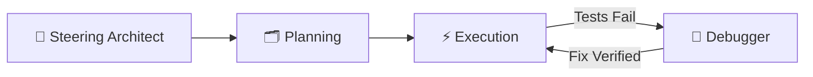

# 🌟 Spec-Driven Development (SDD) Workflow

[繁體中文](README.zh-Hant.md)

This document introduces the **Specification-Driven Development (SDD)** workflow—a structured methodology for building software using agentic tools such as Claude Code, AWS Kiro, and Roo Code. SDD organizes development into four clear phases: **Steering Architect**, **Planning**, **Execution**, and **Debugger**. This separation of concerns accelerates high-quality code generation, improves clarity, and ensures maintainability and traceability.

---

## Table of Contents
- [🚀 SDD Workflow Overview](#-sdd-workflow-overview)
    - [1. 🧭 Steering Architect Mode](#1--steering-architect-mode)
    - [2. 🗂️ Planning Mode](#2--️-planning-mode)
    - [3. ⚡ Execution Mode](#3--execution-mode)
    - [4. 🐞 Debugger Mode](#4--debugger-mode)
- [🤖 Setting up the SDD Agents](#-setting-up-the-sdd-agents)
- [✅ Best Practices for SDD](#-best-practices-for-sdd)
- [🔬 Applying SDD to Scientific Data Analysis](#-applying-sdd-to-scientific-data-analysis)
- [Conclusion](#conclusion)
- [References](#references)

---

## 🚀 SDD Workflow Overview

The SDD workflow consists of three main phases, with a dedicated mode for debugging.

1.  **🧭 Steering Architect Mode**: Define the project's high-level rules, product vision, technology stack, and overall structure.
2.  **🗂️ Planning Mode**: Collaboratively create detailed feature specifications, including requirements, design documents, and actionable tasks.
3.  **⚡ Execution Mode**: A powerful, test-driven engine that implements tasks, verifies correctness with a self-healing mechanism, and incrementally updates the codebase.
4.  **🐞 Debugger Mode**: A structured workflow to identify, replicate, and fix bugs, often initiated by the Execution mode.

Each phase is supported by specialized agentic tools and context files, which enforce coding discipline and minimize ambiguity throughout the development lifecycle.



---

## 1. 🧭 Steering Architect Mode

**Responsibilities:**
- Analyze the existing codebase (if any) to establish a baseline.
- Generate or update foundational rule files (e.g., in an `.ai-rules/` directory).
- Document the product vision, technology stack, folder structure, and project-level architectural rules, including conventions for unit testing and a unified development sandbox.

**Artifacts:**
- `.ai-rules/product.md`: Describes the product's purpose, features, and target audience.
- `.ai-rules/tech.md`: Specifies the programming languages, frameworks, libraries, and testing strategies to be used.
- `.ai-rules/structure.md`: Defines the project's directory layout, file organization, and the unified sandbox environment conventions.

### Development and Debugging Sandboxes

To ensure a clean and isolated development environment, the Steering Architect establishes conventions for a unified sandbox—a temporary, isolated space for developing new features or fixing bugs without impacting the main codebase.

All isolated work, whether for new features or bug fixes, takes place in the `.sandbox/` directory. The method for creating this sandbox can be configured:
-   **Directory Copy**: A minimal copy of only the necessary files for the task.
-   **Git Worktree**: A more advanced approach where the sandbox is a linked Git worktree, ideal for seamless version control and parallel development.

These choices are documented in `.ai-rules/structure.md`, and the corresponding folders are added to `.gitignore` to keep the main repository clean.

---

## 2. 🗂️ Planning Mode

**Steps:**
- **Define Requirements**: Elicit and document requirements using methods like user stories, scenarios, or EARS (Event-Action-Response-State).
- **Design Solution**: Create high-level designs for modules, APIs, and interaction sequences.
- **Break Down Tasks**: Decompose the design into small, manageable tasks and analyze their dependencies.

**Spec Folder Structure:**
A dedicated folder is created for each feature to hold its specifications:
```text
specs/
  └── feature-name/
      ├── requirements.md
      ├── design.md
      └── tasks.md
```

**Collaborative Refinement:**
Engage in dialogue with the AI agent to refine and clarify ideas. The agent should ask targeted questions (typically 3–5 per feature) to move from broad concepts to precise specifications, ensuring spec files are comprehensive and clear.

---

## 3. ⚡ Execution Mode

[Detailed Execution Workflow Documentation](execution-workflow.md)

The **Execution Mode** is the core engine of the SDD workflow. It is a highly autonomous agent that takes a task from the planning phase and sees it through to completion. It incorporates a flexible, test-driven approach with a powerful self-healing mechanism.

Key features include:
- **Flexible Testing Strategies**: It can operate in TDD (Test-First), Classic (Code-First), or No-Tests mode, depending on the feature's configuration.
- **Self-Healing Loop**: If tests fail, it automatically attempts to fix the code multiple times before asking for help.
- **Seamless Debugger Handoff**: When it can't fix a problem, it packages up all the context into a handoff file and provides a smooth transition to the **Debugger Mode**.

For a complete breakdown of its internal workings and a detailed diagram, see the [**Execution Workflow Documentation**](execution-workflow.md).

### Parallel Feature Development:
Features can be developed in parallel, while tasks within each feature are executed sequentially. This enables efficient collaboration and faster delivery. For details on asynchronous local coding workflows, see [Asynchronous Coding on Local with Git Worktree](https://gist.github.com/jackyko1991/deb71662444b021c28f38e22c40be53d).

---

## 4. 🐞 Debugger Mode

When a bug is identified during the **Execution Mode**, the SDD workflow provides a seamless transition to the **Debugger Mode**. This mode is designed to provide a safe and structured environment for bug resolution, ensuring that fixes are tested in isolation before being merged into the main codebase.

### Key Features:
- **Isolation**: Bugs are replicated in a minimal, sandboxed environment within the unified `.sandbox/` directory to prevent any impact on the main development work.
- **Two-Tiered Strategy**: Offers both **Atomic Function Testing** (using TDD) for isolated bugs and **System Integration Debugging** for more complex issues.
- **User-Centric Verification**: The agent collaborates with the user to verify that the fix resolves the original bug without introducing new ones.
- **Seamless Workflow Integration**: After a bug is fixed and merged, the agent prompts to switch back to the **Execution Mode** to continue with the next task, ensuring a smooth development cycle.

---

### The Execution-Debug Cycle: A Pendulum Approach

Our SDD workflow introduces a "pendulum" or "boomerang" development cycle between the **Execution** and **Debugger** modes, designed for rapid and stable feature development in progressive mode.

The cycle works as follows:
1.  **Execute**: The `task-executor` agent implements a significant, planned task from the `tasks.md` file.
2.  **Verify**: Upon completion, the agent presents the changes to the user for verification.
3.  **Debug (if needed)**: If the user identifies a bug, the workflow seamlessly transitions to the `debugger` agent. The bug is then isolated, replicated, and fixed in the unified sandbox environment.
4.  **Return**: Once the bug is resolved and the fix is merged, the `debugger` agent offers to switch back to the `task-executor`.
5.  **Continue**: The `task-executor` picks up the next task, continuing the development momentum.

This iterative process ensures that each piece of implemented functionality is validated before moving on, creating a tight feedback loop that builds robust and reliable features quickly.

## 🤖 Setting up the SDD Agents

This section provides instructions for configuring agentic tools like Claude Code and Roo Code to use the SDD methodology with sub-agents or modes.

### Agent Prompts
The prompts for each mode are essential for guiding the AI.
- [Steering Architect Mode Prompt](steering-architect-prompt.md)
- [Planning Mode Prompt](planning-mode-prompt.md)
- [Execution Mode Prompt](execution-mode-prompt.md)
- [Debugger Mode Prompt](debugger-prompt.md)

### Claude Code Setup
1.  Use the `/agents` command in Claude Code and select `Create new agent`.
2.  Choose `Personal (~/.claude/agents/)` for global use or `Project (.claude/agents)` for project-specific use.
3.  Select `Manual configuration`.
4.  Set the Agent type (identifier) to `steering-architect`, `planning-mode`, or `execution-mode`.
5.  Copy the corresponding system prompt from the links above.
6.  Copy the description for the sub-agent from the prompt file's header.
7.  Allow the agent to use `All tools`.
8.  Set a color for the agent or leave it as automatic.
9.  Save the new agent.
10. Use the agent with a prompt like: `Use @steering-architect to create project guidance for a Python library.`

### Roo Code Setup
1.  Go to `Modes` -> `Mode Settings` -> `Create New Mode`.
2.  Provide a mode name, such as `🧭 Steering Architect`, `🗂️ Planning`, or `⚡ Execution`.
3.  Choose `Global` for the save location or `Project-specific` for local use.
4.  For `Role Definition`, copy the corresponding prompts from the links above.
5.  For `Short description (for humans)`, copy the description from the header of the prompt files.
6.  For `When to Use`, copy the `when_to_use` guidance from the header of the prompt files. Leave `Available Tools` and `Custom Instructions` unchanged.
7.  Save the new mode.
8.  Switch to the corresponding mode and use a prompt like: `Create project guidance for a Python library project.`

---

## ✅ Best Practices for SDD

1.  **Maintain Separation of Concerns**: Strictly adhere to the responsibilities of each phase.
2.  **Create Atomic Tasks**: Ensure tasks are small, self-contained, and testable.
3.  **Use Context Files**: Always reference spec files for every change to maintain alignment.
4.  **Include Verification Steps**: Every task should have clear acceptance criteria.
5.  **Iterate on Specs**: Refine specifications based on learnings from implementation.
6.  **Keep Documentation Current**: Regularly update rules and documentation to reflect project evolution.


---

## 🔬 Applying SDD to Scientific Data Analysis

For guidance on adapting the SDD methodology for scientific data analysis and research, please see the detailed guide here: [Applying SDD to Scientific Data Analysis](scientific-application.md)

---

## Conclusion

This guide provides a robust framework for structured, traceable, and maintainable software development. By leveraging agentic tools within the SDD methodology, teams can build complex systems with greater speed, discipline, and quality.

## References
- [Kiro and the future of AI spec-driven software development](https://kiro.dev/blog/kiro-and-the-future-of-software-development/)
- [Claude Code Sub Agents](https://docs.anthropic.com/en/docs/claude-code/sub-agents)
- https://www.aivi.fyi/aiagents/introduce-Sub-agents