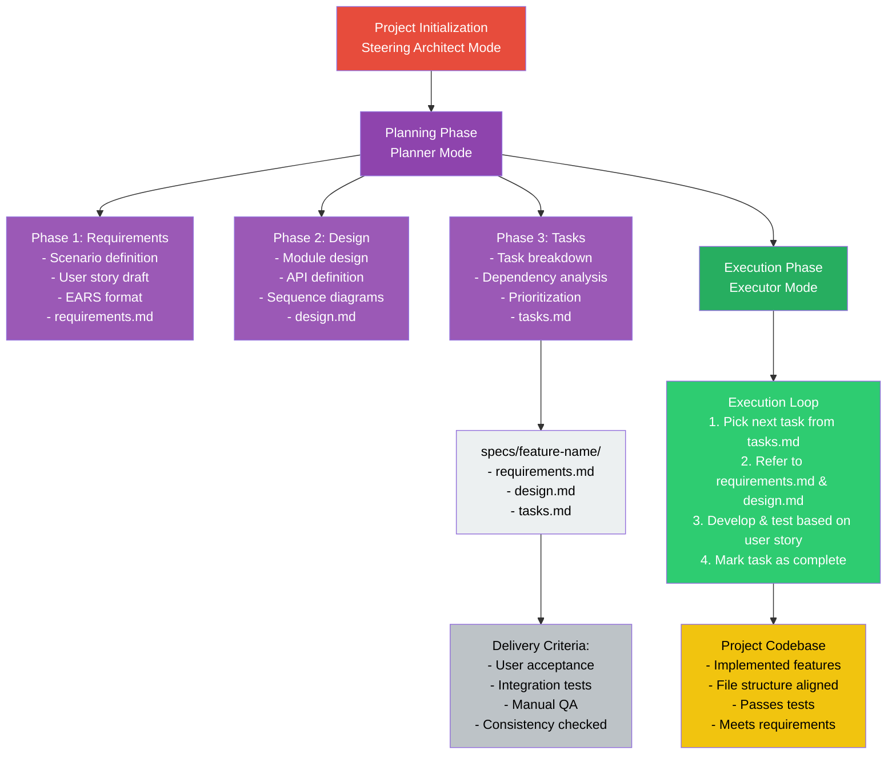

# Spec-Driven Development Workflow

This page illustrates the structured execution flow of spec-driven development when using agentic development tools. It separates planning and execution stages to enhance clarity, maintainability, and traceability in the software development lifecycle.

## Workflow Overview



## Why Spec-Driven?

- **Clarity:** Clear separation of planning and execution enhances team collaboration.
- **Traceability:** Requirements and designs are explicitly versioned and referenced.
- **Quality Assurance:** Each feature must meet documented delivery criteria before merging.

## Folder Structure

```text
specs/
  └── feature-name/
      ├── requirements.md
      ├── design.md
      └── tasks.md
```

Each file contains structured documentation to guide development and verification. This enforces discipline and reduces ambiguity across feature development.
