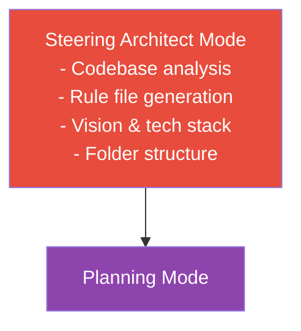
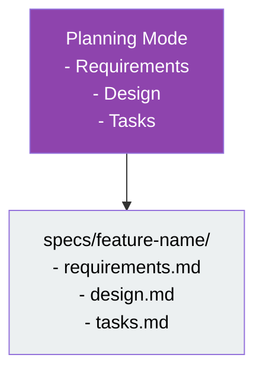
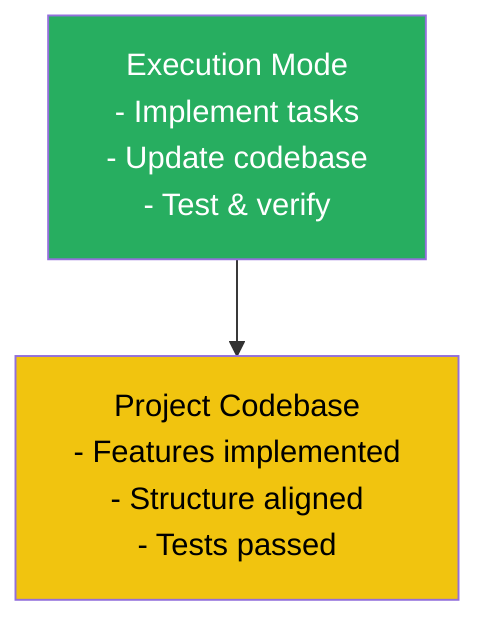

# 🌟 **Spec-Driven Development Workflow**

This article describes the **Specification Driven Development (SDD)** workflow using agentic development tools. The concept was brought in by AWS Kiro but a general application principal with AI assisted software development. The process is split into three main phases: Steering Architect Mode, Planning Mode, and Execution Mode. This separation enhances quick code generation with sufficient repository clarity, maintainability, and traceability.

We specifically use Claude Code terminologies but other agentic development tools have samiliar function aliases. 

---

## 1. 🧭 **Steering Architect Mode**

The Steering Architect sets the foundation for the project by defining high-level rules, product aim, and project structure.

<span style="color:#e74c3c"><b>Responsibilities:</b></span>
- 🕵️‍♂️ Analyze the codebase (`/init`)
- 📝 Generate rule files (e.g., `Claude.md`)
- 🎯 Describe product vision
- 🏗️ Define tech stacks
- 📁 Specify folder structure
- 📜 Create project-level rules



---

## 2. 🗂️ **Planning Phase / Mode**

In Planning Mode, the user interacts with the agent to collaboratively create specification files and folders **for each feature**.

<span style="color:#8e44ad"><b>Steps:</b></span>
- 📖 Define requirements (scenarios, user stories, EARS, etc)
- 🛠️ Design modules, APIs, and sequences
- 🗃️ Break down tasks and analyze dependencies

**Spec Folder Structure:**
```text
specs/
  └── feature-name/
      ├── requirements.md
      ├── design.md
      └── tasks.md
```

**Interaction Example:**
- 🤝 The agent prompts the user for requirements and design details.
- 🗂️ The agent generates and organizes the spec files in the appropriate folder.



---

## 3. ⚡ **Execution Phase / Mode**

In Execution Mode, the agent picks tasks from the spec folder and implements them in the codebase.

<span style="color:#27ae60"><b>Steps:</b></span>
1. 🏁 Select next task from `tasks.md`
2. 📚 Reference `requirements.md` and `design.md`
3. 💻 Develop and test based on user story
4. ✅ Mark task as complete

**Outcome:**
- 🟢 Codebase is updated to reflect implemented features
- 🧪 Delivery criteria are checked (user acceptance, integration tests, QA, consistency)



---

Each spec file guides development and verification, enforcing discipline and reducing ambiguity across feature development.
