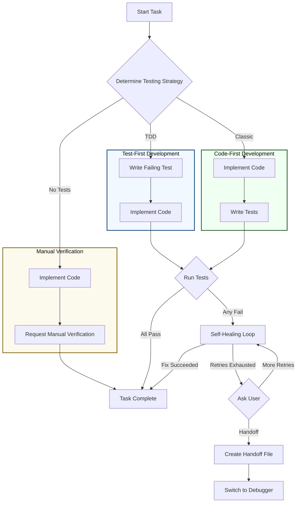

# ⚡ Execution Workflow
[繁體中文](execution-workflow.zh-Hant.md)

This document details the robust and flexible workflow of the **Task Executor** agent. This agent is designed to handle software development tasks using one of three testing strategies, and includes a powerful self-healing mechanism to automatically resolve issues.

## Detailed Workflow Diagram

---

## Testing Strategies

The executor's behavior is determined by the testing strategy chosen for a given feature.

### 1. TDD (Test-First Development)
This is the recommended approach for ensuring code quality and correctness from the outset.
1.  **Write a Failing Test**: The agent first writes a unit test that captures the requirements of the task. This test is expected to fail.
2.  **Implement Code**: The agent then writes the minimum amount of production code required to make the failing test pass.
3.  **Verify**: The full test suite is run. If all tests pass, the task is complete. If any test fails, the **Self-Healing Loop** is initiated.

### 2. Classic (Code-First Development)
This traditional approach is useful for rapid prototyping or when requirements are still evolving.
1.  **Implement Code**: The agent writes the production code to satisfy the task's requirements.
2.  **Write Tests**: The agent writes unit tests to validate the code that was just written.
3.  **Verify**: The full test suite is run. If any test fails, the **Self-Healing Loop** is initiated.

### 3. No Automated Tests
This strategy is generally reserved for tasks where automated testing is not feasible or necessary (e.g., minor UI tweaks, documentation updates).
1.  **Implement Code**: The agent writes the code.
2.  **Manual Verification**: The agent stops and asks the user to manually verify the changes.

---

## Self-Healing Loop

When an automated test fails in either the TDD or Classic workflow, the executor does not give up immediately. It enters a self-healing loop to attempt to fix the problem autonomously.

-   **Max Retries**: The agent has a default of **3 attempts** to fix the code.
-   **Process**:
    1.  **Analyze**: It analyzes the error message from the failing test.
    2.  **Fix**: It modifies the code based on its analysis.
    3.  **Re-run**: It runs the tests again.
-   **Escalation**: If the agent cannot fix the issue within its retry limit, or if it determines the problem is too complex for it to solve, it will escalate to the user.

---

## Handoff to Debugger

When escalation is necessary, the process is designed to be seamless and preserve context.
1.  **Ask User**: The executor asks the user if it should try for another 3 retries or handoff to the `debugger`.
2.  **Create Handoff File**: If the user chooses to handoff, the executor creates a detailed report at `.sandbox/handoff/<timestamp>.md`. This file contains the full context: the failing test, the code it wrote, and its analysis of the problem.
3.  **Switch Mode**: The user can then switch to the `debugger` mode, which will automatically read the handoff file and be ready to assist with a full understanding of the problem.

---