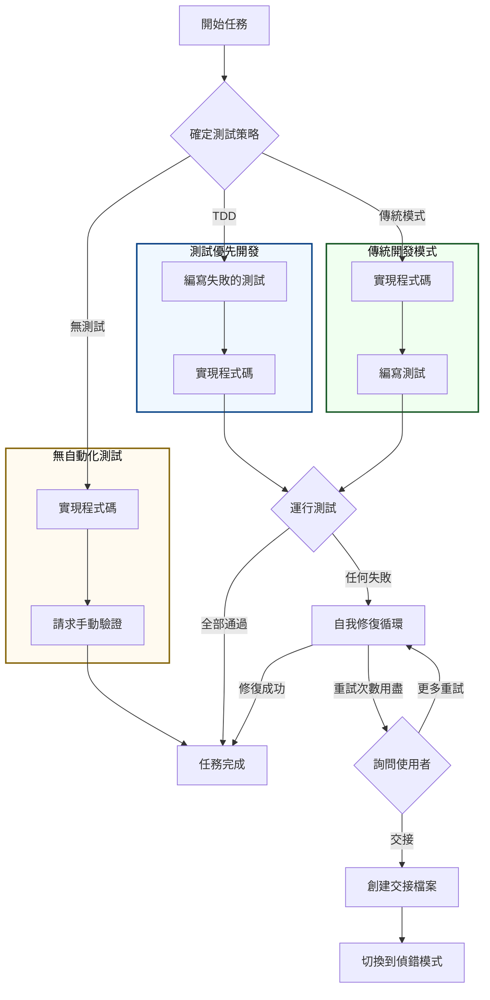

# ⚡ 執行工作流程
[English](execution-workflow.md)

本文件詳細介紹了 **任務執行者 (Task Executor)** 代理的強大而靈活的工作流程。此代理旨在透過三種測試策略之一來處理軟體開發任務，並包含強大的自我修復機制以自動解決問題。

## 詳細工作流程圖

---

## 測試策略

執行者的行為由為特定功能選擇的測試策略決定。

### 1. TDD (測試優先開發)
這是從一開始就確保程式碼品質和正確性的建議方法。
1.  **編寫失敗的測試**：代理首先編寫一個單元測試，該測試捕捉了任務的需求。此測試預期會失敗。
2.  **實現程式碼**：然後，代理編寫使失敗的測試通過所需的最少量產品程式碼。
3.  **驗證**：運行完整的測試套件。如果所有測試都通過，則任務完成。如果有任何測試失敗，則啟動**自我修復循環**。

### 2. 傳統開發模式 (程式碼優先開發)
這種傳統方法適用於快速原型設計或需求仍在演變時。
1.  **實現程式碼**：代理編寫產品程式碼以滿足任務的需求。
2.  **編寫測試**：代理編寫單元測試以驗證剛才編寫的程式碼。
3.  **驗證**：運行完整的測試套件。如果有任何測試失敗，則啟動**自我修復循環**。

### 3. 無自動化測試
此策略通常保留給自動化測試不可行或不必要的任務（例如，輕微的 UI 調整、文件更新）。
1.  **實現程式碼**：代理編寫程式碼。
2.  **手動驗證**：代理停止並要求使用者手動驗證變更。

---

## 自我修復循環

當自動化測試在 TDD 或傳統工作流程中失敗時，執行者不會立即放棄。它會進入一個自我修復循環，以自主嘗試解決問題。

-   **最大重試次數**：代理預設有 **3 次**機會修復程式碼。
-   **過程**：
    1.  **分析**：它會分析來自失敗測試的錯誤訊息。
    2.  **修復**：它會根據其分析修改程式碼。
    3.  **重新運行**：它會再次運行測試。
-   **升級**：如果代理在重試次數限制內無法解決問題，或者它確定問題過於複雜無法解決，它將會向使用者尋求協助。

---

## 向偵錯模式交接

當需要升級時，該過程設計為無縫且能保留上下文。
1.  **詢問使用者**：執行者會詢問使用者是應該再嘗試 3 次重試，還是交接給 `debugger`。
2.  **創建交接檔案**：如果使用者選擇交接，執行者會在 `.sandbox/handoff/<timestamp>.md` 創建一份詳細的報告。該檔案包含完整的上下文：失敗的測試、它編寫的程式碼，以及它對問題的分析。
3.  **切換模式**：然後，使用者可以切換到 `debugger` 模式，該模式將自動讀取交接檔案，並在對問題有全面了解的情況下準備好提供協助。

---